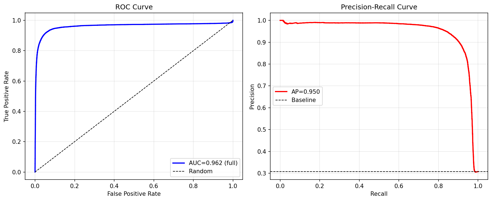
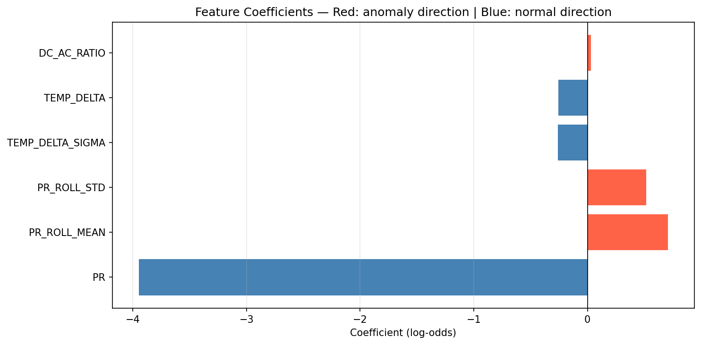

# RTU-MODEL — Edge + Fog Smart Solar PV Analytics

This directory implements core edge/fog algorithms for solar PV anomaly detection as part of the **LicheeRV + Pi fog** distributed monitoring system.

---

## Directory Structure

```
RTU-MODEL/
├── model_output
│   ├── LOG_REG
│   │   ├── feature_importance.png
│   │   ├── logreg_risk_model.joblib  # LOG-REG MODEL FILE
│   │   ├── model_config.json
│   │   ├── roc_pr_curves.png
│   │   └── sample_inference_scores.csv
│   └── YOLO
│       ├── benchmark_report.txt       # MODEL BENCHMARKS FOR RUNNING ON LICHEERV NPU DEV BOARD
│       └── yolov8n.pt                 # YOLO MODEL FILES
├── Notebooks and Scripts
│   ├── anomaly_injection.py        #ATTEMPT TO INJECT IMAGE ANOMALIES SYNTHETICALLY ALONGSIDE WITH OTHER TELERMETRY
│   ├── logreg_leak_free-1.ipynb 
│   └── yolo_pipeline_fixed.ipynb
├── Readme.md
├── requirements.txt
├── training_dataset(imputed with synthetic img inferences).csv #DATASET FOR LOG-REG MODEL USUALLY SENT FROM RTU
```


## Key Components

### 1. [Notebooks and Scripts/](./Notebooks%20and%20Scripts/)
- **yolo_pipeline_fixed.ipynb**: End-to-end workflow for YOLOv8n:
    - Training on annotated PV panel anomalies (`bird_drop`, `cracked`, `dusty`, `panel`)
    - Export to ONNX INT8 for LicheeRV NPU acceleration
    - Hardware resource benchmarking
    - Extraction of final image-score features
- **logreg_leak_free-1.ipynb**: Implements:
    - Rigorous non-leaky telemetry feature selection
    - Cross-plant (site-to-site) generalization validation for anomaly/failure risk prediction
    - Benchmarking, thresholding, and config export for fog model

---

### 2. [model_output/LOG_REG/model_config.json](model_output/LOG_REG/model_config.json)
| Metric                | Value      |
|-----------------------|-----------|
| ROC-AUC (all data)    | 0.962     |
| Average Precision     | 0.950     |
| Brier Score           | 0.215     |
| Best F1 Threshold     | 0.05      |
| High Recall Threshold | 0.05      |
| Split Strategy        | cross_plant |
| Features Used         | PR, TEMP_DELTA, DC_AC_RATIO, PR_ROLL_MEAN, PR_ROLL_STD, TEMP_DELTA_SIGMA |
| Image Features        | Not used yet (planned)    |

*ROC curve example:*





---

### 3. [model_output/YOLO/benchmark_report.txt](model_output/YOLO/benchmark_report.txt)
| Metric               | Value     |
|----------------------|-----------|
| ONNX INT8 Model Size | 3.20 MB   |
| Mean CPU Latency     | 35.8 ms   |
| Est. NPU Latency     | 2.4 ms    |
| RAM Used             | 48.7 MB   |
| RAM Remaining        | 151.3 MB  |
| Memory Safe          | YES       |
| Viable for Deployment| YES       |

*Confusion matrix/mAP/etc. — see pipeline outputs for full metrics.*

---

### 4. [training_dataset(imputed with synthetic img inferences).csv](./training_dataset(imputed%20with%20synthetic%20img%20inferences).csv)
- Full dataset for model development: **telemetry** (sensor) + current **image scores**
- Ready for re-training as real YOLO on-device results are available

### 5. [YOLO Training dataset from IEEE Dataport](https://ieee-dataport.org/documents/solar-panel-anomaly-detection-dataset-based-solar-insecticidal-lamp-internet-things)


Citation Author(s):
    Xing Yang (Anhui Science and Technology University)
    Hongye Fang (Anhui Science and Technology University)
Submitted by:
    Xing Yang 
[DOI](10.21227/33xj-3073)


---


## Design Questions

**Q: Why not TinyML?**  
*A: LicheeRV is a Linux SBC; YOLO runs in standard ONNX/Ultralytics Python. No resource constraints or firmware deployment; TinyML is only needed for microcontroller/MCU-class hardware.*

**Q: How does feature selection avoid leakage?**  
*A: Only non-leaky telemetry features (see model config) are included. Image scores will be included as soon as real YOLO outputs are fielded; synthetic features currently excluded.*

**Q: How are models evaluated?**  
*A: Cross-plant (site-to-site) splits, strict ROC-AUC, Average Precision, and calibration (Brier score) reporting. Hardware suitability is profiled in YOLO benchmark.*

**Q: Is deployment feasible on your edge/fog hardware?**  
*A: Yes! LicheeRV with NPU (YOLOv8n), and Python/scikit-learn-based regression on fog. Both pass runtime, memory, and accuracy requirements.*

---

## REPO

- https://github.com/Dev-onion73/SIH-RTU-Sim/RTU-MODEL

